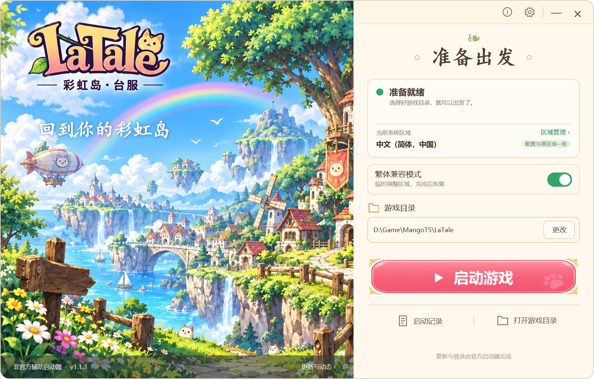
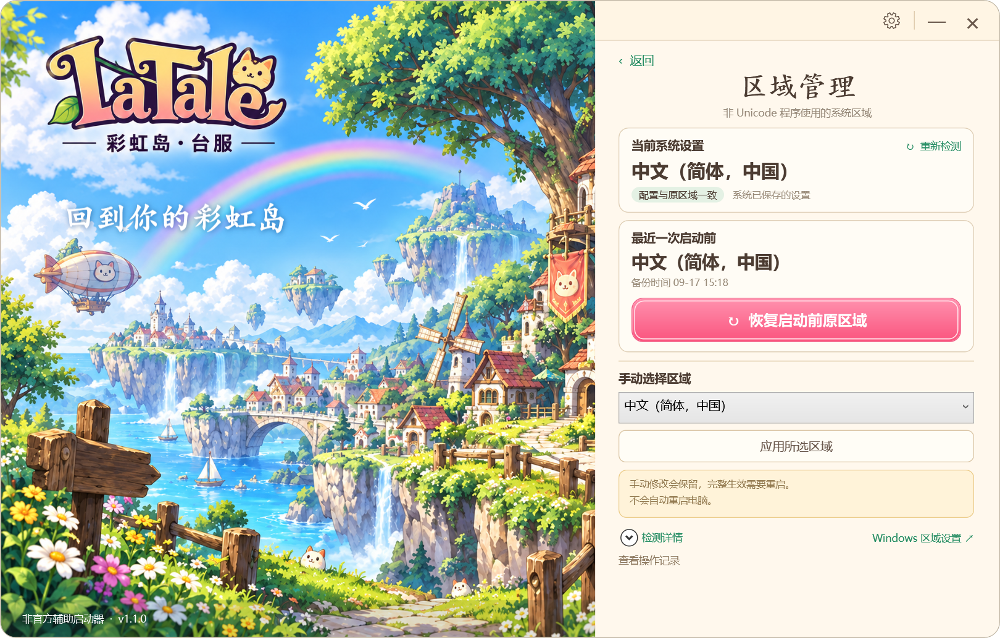

# LaTale Garden

**彩虹岛台服的轻量启动器。** 遇到中文乱码时，可以用繁体兼容模式启动游戏，也可以随时检查、恢复系统区域设置。

[下载启动器](https://github.com/visionki/latale-garden/releases/download/v1.1.2/LaTaleGarden.exe) · [查看版本更新](https://github.com/visionki/latale-garden/releases) · [反馈问题](https://github.com/visionki/latale-garden/issues)

## 快速开始

1. **下载并打开**：下载 `LaTaleGarden.exe`，双击即可，无需安装。
2. **选择游戏**：首次打开时点击“更改”，选择彩虹岛安装文件夹里的 `LaTaleLauncher.exe`。以后会自动记住。
3. **点击“启动游戏”**：先退出已经打开的游戏和官方启动器。保留默认开启的“繁体兼容模式”，出现 Windows 管理员授权提示时选择允许。
4. **进入游戏**：在打开的官方启动器中完成更新、登录并开始游戏。LaTale Garden 会显示进度，并在启动流程完成后恢复原区域设置。

请先安装好彩虹岛台服客户端。启动器面向 Windows 10 / 11 的 64 位电脑，目前为公开测试版；兼容范围见下方说明。



## 常用功能

| 你想做什么 | 在哪里操作 |
| --- | --- |
| 使用繁体环境启动游戏 | 保持首页“繁体兼容模式”开启，点击“启动游戏”。 |
| 按普通方式启动 | 关闭“繁体兼容模式”后启动，不调整系统区域。 |
| 看看当前是什么区域 | 查看首页“当前系统区域”，或进入“区域管理”重新检测。 |
| 再恢复一次原区域 | 在“区域管理”中确认备份和时间，点击“恢复启动前原区域”。 |
| 手动切换简体或繁体 | 退出游戏和官方启动器，在“区域管理”中选择并应用。该选择会保留，完整生效需要重启电脑。 |
| 排查失败原因 | 打开“启动记录”，查看或导出诊断日志。 |
| 找到作者或反馈问题 | 点击右上角“关于与反馈”；启动记录页也有反馈入口。 |



## 使用中遇到问题

**一直在等游戏？** 请到官方启动器完成更新、登录并点击开始游戏。“显示启动器”会切回它；不想继续时，可以“取消等待并恢复”。

**提示原设置尚未恢复？** 先点击“恢复原设置”，或进入“区域管理”核对备份并再次恢复。没有有效备份时，可明确选择需要的简体或繁体区域。

**显示游戏已启动，但文字仍乱码？** “游戏已启动”表示程序已经运行。可以退出游戏后，在设置中适当延长“游戏出现后的初始化等待”，再尝试一次；仍有问题时请提交反馈。

**移动位置或升级需要重新设置吗？** 先退出旧版窗口和托盘图标，再打开新版。使用同一个 Windows 账户时会保留原游戏目录和设置。新版处理过的区域记录请继续用新版打开。

## 作者与反馈

由 [visionki](https://github.com/visionki) 开发和维护。项目源码、版本更新和问题讨论集中在本仓库。

遇到问题或有功能建议，欢迎到 [GitHub Issues](https://github.com/visionki/latale-garden/issues) 提交。反馈时请尽量提供：

- 使用的启动器版本、Windows 版本。
- 操作步骤、看到的提示，以及游戏中文字是否正常。
- 必要时附截图或从“启动记录”导出的诊断日志。

诊断日志包含本机路径和区域信息，公开前请检查并遮去个人信息。也欢迎通过 Pull Request 改进代码、文档或兼容性。

## 运行环境与验证范围

- Windows 10 / Windows 11 **64 位**，.NET Framework **4.8 或更高版本**。如果启动时提示缺少该组件，请先安装后再打开；Win7 不在当前支持范围内。
- Win11 25H2 已验证区域切换与恢复。**Win10 实机、进入游戏后的文字及完整登录游玩流程仍待验收**，当前版本作为公开测试版发布。
- Windows 系统区域修改完整生效需要重启。临时切换在具体游戏中的效果取决于 Windows 和客户端版本，配置检测成功不等于游戏内乱码已修复。
- 启用 UTF-8 系统代码页（65001）时，暂不支持繁体兼容模式和手动简繁选择，仍可使用标准启动。

具体检查范围与结果见 [验证记录](VALIDATION.md)，版本变化见 [更新记录](CHANGELOG.md)。

## 工作方式

LaTale Garden 由原生 WPF 界面、启动监控、区域管理和独立恢复进程组成。官方客户端负责游戏更新与账号登录。

兼容启动的流程是：**保存原区域 → 临时设置繁体台湾区域 → 启动官方启动器 → 等待本次游戏窗口稳定 → 恢复并核对原设置**。

区域操作调用 Windows 的 `Set-WinSystemLocale`；备份包括区域及 `Default`、`ACP`、`OEMCP`、`MACCP` 原值。恢复按备份执行，支持原先使用其他语言区域的电脑。

- 通过游戏路径、进程创建时间与窗口稳定状态判断本次启动，初始化等待默认 20 秒，最长等待默认 30 分钟，可在设置中调整。
- 取消、超时和启动失败时尝试恢复。工作进程异常退出后，独立恢复进程可接管；未完成的记录保留到下次打开处理。
- 手动“再次恢复”会重新应用备份，即使之前标记为已完成。手动“选择区域”成功后则保留选择，失败时回退。
- 区域检测分别显示系统保存的配置与新进程读数。读取失败或配置变化时标明结果过期，要求重新检测。
- 启动和区域修改共用写入锁；手动选区前检查游戏已退出。人工处理损坏历史记录时保留原文件，并记录处理关系。

如果系统断电、所有恢复进程同时被结束或备份丢失，无法保证即时恢复。存在待恢复记录时，请先完成恢复，再清理本地数据。

参考：[Microsoft 系统区域设置](https://learn.microsoft.com/en-us/powershell/module/international/set-winsystemlocale) · [Microsoft .NET Framework 系统要求](https://learn.microsoft.com/en-us/dotnet/framework/get-started/system-requirements)

## 文件与本地数据

发布包只需一个 `LaTaleGarden.exe`，界面和美术素材均已内置。可以放在任意方便的位置，运行时不会在它旁边生成配置或素材文件。

设置、日志与恢复记录统一保存在当前 Windows 用户的 `%LOCALAPPDATA%\LaTaleGarden`。换电脑或 Windows 账户后，需要重新选择游戏目录。手动导出的日志写入所选位置。

<details>
<summary>查看数据文件结构</summary>

```text
%LOCALAPPDATA%\LaTaleGarden\
├── settings.json               游戏目录与偏好设置
├── error.log                   异常记录（需要时生成）
└── Sessions\
    └── <会话标识>\
        ├── request.json        游戏启动参数
        ├── region-request.json 区域管理参数
        ├── status.json         操作状态
        ├── launch.log          操作与恢复日志
        ├── recovery.json       区域备份与恢复标记
        └── resolved.json       人工处理记录关联（需要时生成）
```

</details>

## 开发与构建

使用 Windows x64 和 .NET Framework 4.8 或更高版本。在仓库根目录运行：

```powershell
.\build.ps1
.\test.ps1
.\test-ui.ps1
.\test-portable.ps1
```

`build.ps1` 使用系统 C# 编译器，输出 `dist\LaTaleGarden.exe`，无需下载 NuGet 包。普通测试不修改系统区域、不启动游戏：

| 脚本 | 检查内容 |
| --- | --- |
| `test.ps1` | 启动与区域操作的故障分支、恢复意图，以及 Windows 进程和文件行为。 |
| `test-ui.ps1` | 原生区域页面的状态、按钮可用性与布局。 |
| `test-portable.ps1` | 独立 EXE 启动、移动后读取同一设置，以及不产生旁边文件。 |

另有显式启用的实机检查 `test-region-live.ps1 -AllowSystemLocaleChanges`，会请求管理员权限，**实际切换系统区域并恢复**。退出游戏后再运行，结果异步写入脚本输出的测试目录；查看 `complete.txt`、`results.txt` 与 `baseline.json`。独立保护进程在测试异常退出时尝试恢复基线。此脚本不纳入普通测试步骤。

### 项目结构

| 文件 | 用途 |
| --- | --- |
| `MainWindow.xaml` / `LauncherWindow.cs` | 主窗口、设置、日志、关于与反馈。 |
| `LaunchEngine.cs` | 启动、等待、取消及恢复流程。 |
| `RegionManagement.cs` / `LauncherRegion.cs` | 区域检测、手动操作与历史记录处理。 |
| `WindowsPlatform.cs` | Windows 区域接口、进程身份、窗口操作及子进程管理。 |
| `Program.cs` / `Models.cs` | 程序入口、恢复进程、项目资料、本地数据与原子 JSON 写入。 |
| `Tests/` | 流程、界面及实机检查。 |
| `Assets/` / `ASSETS.md` | 界面美术与素材说明。 |

## 项目说明

LaTale Garden 是面向彩虹岛台服玩家的非官方辅助工具，与游戏运营方无隶属关系。游戏内容、品牌及相关权益归其权利方所有。本项目不提供游戏账号或运营服务。
